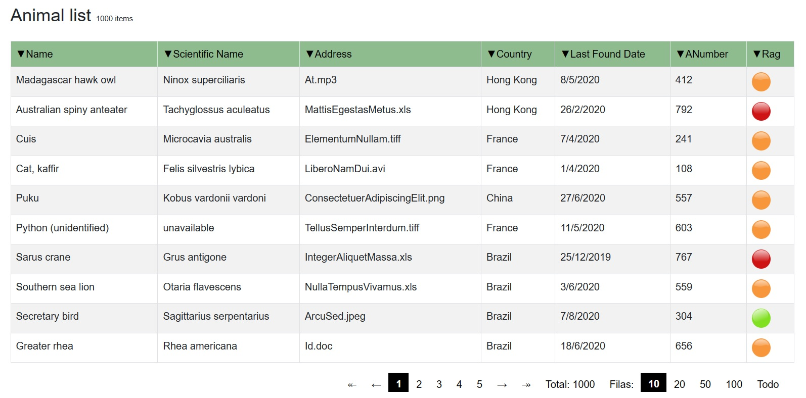
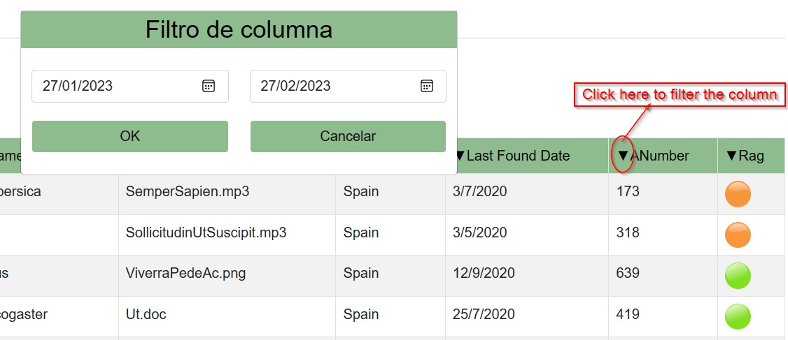

[](https://github.com/alexarriete/BlazorCommon/blob/master/Readme.md) [](https://github.com/alexarriete/BlazorCommon/blob/master/Readme.es.md)

# What is BlazorCommon?

It is a set of Blazor components grouped in an RCL library with the purpose of speeding up the construction of applications and contributing to both own and collective knowledge.

# Dependencies

_In current version_

- net7.0 (_For projects in .net 6 use Version 6.00_)
- ClosedXML (>= 0.100.3)
- Microsoft.AspNetCore.Components .Web (>= 7.0.0)

# How it works?

After installing the [Nuget package](https://www.nuget.org/packages/BlazorCommon) we can start using the components in a Blazor project.

```csharp
using BlazorCommon;
using BlazorCommon.Grid;
...

```

## Grid

Grids are one of the most used components today, they are also one of the main headaches when it comes to maintaining the code. We present a simple and configurable option.



##### How to implement it

_Code behind_

```csharp
using BlazorCommon.Grid;
using BlazorCommon;
using Microsoft.AspNetCore.Components;

namespace BlazorCommonTester.Pages
{
    public class GridBase : HtmlComponentBase
    {
        protected GridConfigurationBase GridC { get; set; }
        protected override async Task OnInitializedAsync()
        {
            GridC = await GridConfigurationBase.GetInstanceAsync();
           await base.OnInitializedAsync();
        }

    }
}

```

_Front_

```c#
<BlazorCommon.Grid.Grid GridConfig="GridC"  />
```

If your practical interest is not to always present the same information about the last time an animal was sighted, all you have to do is overwrite the GetList() method of the QueryResultBase Class.

_QueryResultBase Class_

```csharp
 public class QueryResultBase
    {
        public int NotFilteredTotal { get; set; }
        public int Total { get; set; }
        public IEnumerable<RowBase> List { get; set; }
        public int PageSize { get; set; }
        public int PageIndex { get; set; }
        public SortChangedEvent Sort { get; set; }

        public QueryResultBase()
        {
            PageSize = 10;
            PageIndex = 1;
        }

        public virtual void GetList()
        {
            List = Animal.GetAll();
        }
```

**Note:** The List property of the class derives from RowBase; Thus, for everything to go well, the class that makes up the list must derive from this class.

```csharp
 public IEnumerable<RowBase> List { get; set; } // Property of QueryResultBase
```

```csharp
   public class RowBase
    {
        public string RowBaseBackGroundColor { get; set; }
        public string RowBaseFontColor { get; set; }
        public string RowBaseId { get; set; }
        public bool RowBaseSelected { get; set; }
        public bool RowBasePreviousSelected { get; set; }
        public bool RowBaseVisible { get; set; }
        public List<ExpandedRowOption> ExpandedRowOptions { get; set; }
        public bool RowExpanded { get; set; }

        public RowBase()
        {
            RowBaseBackGroundColor = "white";
            RowBaseFontColor = "black";
            Random r = new Random();
            int rInt = r.Next(0, 100000000);
            RowBaseId = $"row_{rInt}";
            RowBaseVisible= true;
        }

        public virtual void SetExpandedRowOptions()
        {
            ExpandedRowOptions = Enum.GetValues(typeof(ExpandedRowOption)).Cast<ExpandedRowOption>().ToList();
        }

        public virtual async Task OnRowClick(JsHelper jsHelper)
        {
            RowExpanded = !RowExpanded;
            if(RowExpanded)
            {
                SetExpandedRowOptions();
                await jsHelper.SetSessionStorage("row", this);
            }
            else
            {
                await jsHelper.RemoveSessionStorage("row");
            }
        }

    }
```

The RowBase class determines the behavior and appearance of rows within the table, so the list received by the grid must inherit from it.

```csharp
 public class MyList: RowBase
    {
       ...
    }
```

##### Filters

By default the grid implements the filters and the ordering of all its columns. This can be changed using a class derived from GridColumnBase. This in turn is initialized from GridConfigurationBase, which is finally the object that we pass as a parameter to the component.



```csharp

  public virtual List<GridColumnBase> GetGridColumnBase()
        {
            List<PropertyInfo> baseProperties = new RowBase().GetType().GetProperties().ToList();
            List<PropertyInfo> props = ItemType.GetProperties().Where(x => !baseProperties.Any(s => s.Name == x.Name)).ToList();

           return props.Select(x => new GridColumnBase(x, props.IndexOf(x), KeyColumn)).ToList();
        }

// And GridColumnBase constructor

 public GridColumnBase(PropertyInfo prop, int position, string keyColumnName, bool searchable =true, bool sortable= true)
        {
            ...
        }

```

## Summary

As you can see, it is enough to change the data source and that the objects in this list belong to a class derived from RowBase. There are many things that can be configured. We invite you to explore the complete code of the project in [GitHub.](https://github.com/alexarriete/BlazorCommon)
